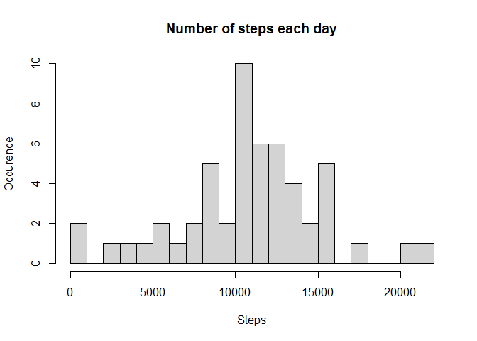
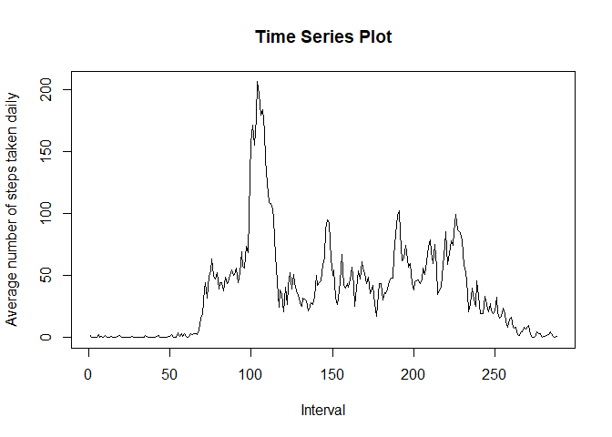
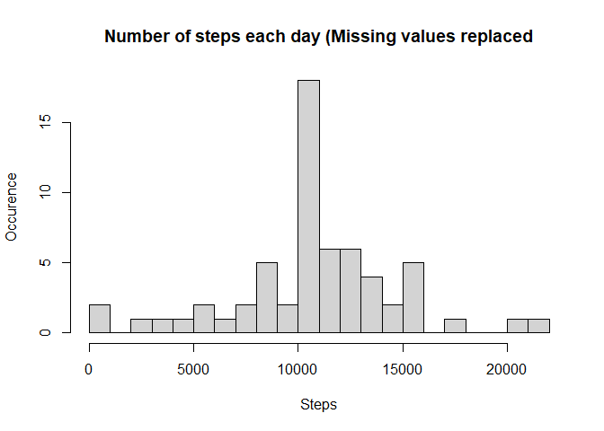
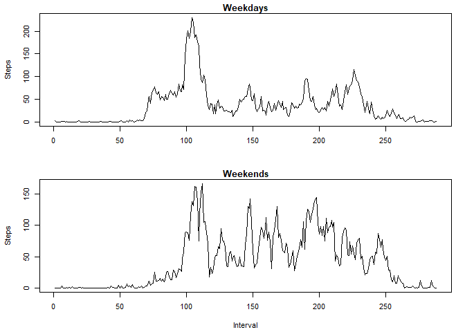

#Course Project 1 of Reproducible Research

Reading source data from 'activity' file and plotting histogram

```r
setwd("C:/Users/asus/Desktop/final")
ad<-read.csv("activity.csv")
a<-tapply(ad$steps,ad$date,sum)
a<-as.numeric(a)
hist(a, breaks = 20,main = "Number of steps each day", xlab = "Steps", ylab = "Occurence")
```

<!-- -->

Calculating mean and median number of steps each day

```r
meansteps<-mean(a,na.rm=TRUE)
mediansteps<-median(a, na.rm=TRUE)
cat("Mean number of steps is ", meansteps, " and Median number of steps is ", mediansteps)
```

```
## Mean number of steps is  10766.19  and Median number of steps is  10765
```

Plotting "Average daily activity pattern"

```r
b<-tapply(ad$steps,ad$interval,mean,na.rm=TRUE)
plot(b,type="l", main="Time Series Plot", xlab = "Interval", ylab = "Average number of steps taken daily")
```

<!-- -->

```r
maxint<-which.max(b)
maxval<-max(b)
cat("Maximum value of steps is ", maxval," and occuring at interval ",maxint)
```

```
## Maximum value of steps is  206.1698  and occuring at interval  104
```

Imputing missing values

```r
naval<-sum(is.na(ad$steps))
cat("Missing values exists in ", naval," rows")
```

```
## Missing values exists in  2304  rows
```

```r
adn<-ad
naact<-is.na(adn$steps)
adn$steps[naact] <- b[as.character(adn$interval[naact])]
```

Plotting histogram after imputing missing values

```r
an<-tapply(adn$steps,adn$date,sum)
an<-as.numeric(an)
hist(an, breaks = 20,main = "Number of steps each day (Missing values replaced", xlab = "Steps", ylab = "Occurence")
```

<!-- -->

Calculating mean and median number of steps each day after imputing missing values

```r
meanstepsn<-mean(an,na.rm=TRUE)
medianstepsn<-median(an, na.rm=TRUE)
cat("Mean number of steps is ", meanstepsn, " and Median number of steps is ", medianstepsn)
```

```
## Mean number of steps is  10766.19  and Median number of steps is  10766.19
```

Difference in activity pattern between weekdays and weekends

```r
adn$date<-as.Date(adn$date)
adn$day<-weekdays(adn$date)
adndays<-subset(adn,adn$day %in% c("Monday","Tuesday","Wednesday","Thursday","Friday"),select = c(steps,interval))
adnend<-subset(adn,adn$day %in% c("Saturday","Sunday"),select = c(steps,interval))
bdays<-tapply(adndays$steps,adndays$interval,mean)
bend<-tapply(adnend$steps,adnend$interval,mean)
par(mfrow = c(2, 1))
par(cex=0.7, mai=c(0.6,0.6,0.2,0.2))
plot(bdays,type="l",xlab = "", main="Weekdays", ylab = "Steps")
plot(bend,type="l", main="Weekends",xlab = "Interval", ylab="Steps")
```

<!-- -->
